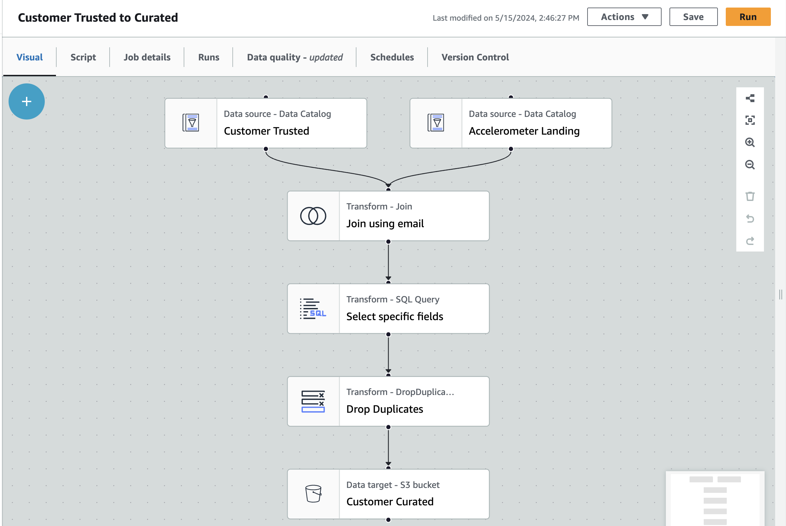

## STEDI Human Balance Analytics
In this project, you'll act as a data engineer for the STEDI team to build a data lakehouse solution for sensor data that trains a machine learning model.
### Project Details
The STEDI Team has been hard at work developing a hardware STEDI Step Trainer that:

- trains the user to do a STEDI balance exercise;
- and has sensors on the device that collect data to train a machine-learning algorithm to detect steps;
- has a companion mobile app that collects customer data and interacts with the device sensors.

STEDI has heard from millions of early adopters who are willing to purchase the STEDI Step Trainers and use them.

Several customers have already received their Step Trainers, installed the mobile application, and begun using them together to test their balance. The Step Trainer is just a motion sensor that records the distance of the object detected. The app uses a mobile phone accelerometer to detect motion in the X, Y, and Z directions.

The STEDI team wants to use the motion sensor data to train a machine learning model to detect steps accurately in real-time. Privacy will be a primary consideration in deciding what data can be used.

Some of the early adopters have agreed to share their data for research purposes. Only these customers’ Step Trainer and accelerometer data should be used in the training data for the machine learning model.

### Project Summary
As a data engineer on the STEDI Step Trainer team, you'll need to extract the data produced by the STEDI Step Trainer sensors and the mobile app, and curate them into a data lakehouse solution on AWS so that Data Scientists can train the learning model.

### Project Environment
You'll use the data from the STEDI Step Trainer and mobile app to develop a lakehouse solution in the cloud that curates the data for the machine learning model using:

-   Python and Spark
-   AWS Glue
-   AWS Athena
-   AWS S3

### Project Data
STEDI has three JSON data sources to use from the Step Trainer. Check out the JSON data in the starter folder:
- customer
- step_trainer
- accelerometer

#### Customer Records
This is the data from fulfillment and the STEDI website. It contains the following fields:
- serialnumber
- sharewithpublicasofdate
- birthday
- registrationdate
- sharewithresearchasofdate
- customername
- email
- lastupdatedate
- phone
- sharewithfriendsasofdate

This is a [sample](https://github.com/grace-omotoso/aws-spark-and-glue/blob/master/starter/customer/landing/customer-1691348231425.json) file 

#### Step Trainer Records
This is the data from the motion sensor. It contains the following fields:
- sensorReadingTime
- serialNumber
- distanceFromObject

This is a [sample](https://github.com/grace-omotoso/aws-spark-and-glue/blob/master/starter/step_trainer/landing/step_trainer-1691348232038.json) file 

### Accelerometer Records
This is the data from the mobile app. It contains the following fields:
- timeStamp
- user
- x
- y
- z

This is a [sample](https://github.com/grace-omotoso/aws-spark-and-glue/blob/master/starter/accelerometer/landing/accelerometer-1691348231445.json) file 

### Processing Steps
1. **Copy project data to a local directory**: Copy the project data from the starter folder and paste in your local project directory.

2. **Make an s3 bucket**: This can be done with the cloudshell CLI within AWS or the console itself. To make a bucket with CLI use the command  
    `aws s3 mb <bucket-name> e.g aws s3 s3://stedi-hba` 

3. **Copy data to bucket**: To simulate the data coming from the various sources, you will need to create your own S3 directories for customer_landing, step_trainer_landing, and accelerometer_landing zones, and copy the data there as a starting point. This can be done with the cloudshell CLI within AWS or the console itself.  To make a bucket with CLI use the command  
`aws s3 cp <directory to copy objects from> <bucket-directory with folder paths> --recursive` e.g
`aws s3 cp customer/landing/ s3://stedi-hba/customer/landing --recursive`

4. **Inspect Data:** To get a feel for the data you are dealing with in a semi-structured format, create two Glue tables for the two landing zones. See queries in the accelerometer and customer landing SQL scripts.

*Note:* The glue scripts in the Glue Scripts folder may look overwhelming. Relax, they were all generated using glue's visual ETL. Screnshots are provided in the Data Sanitization section for each transformation.

5.  **Data Sanitization**
    - Sanitize the Customer data from the Website (Landing Zone) and only store the Customer Records who agreed to share their data for research purposes (Trusted Zone) - creating a Glue Table called customer_trusted. The customer field sharewithresearchasofdate that are not null should be used to determine this. 

    

    - Sanitize the Accelerometer data from the Mobile App (Landing Zone) - and only store Accelerometer Readings from customers who agreed to share their data for research purposes (Trusted Zone) - creating a Glue Table called accelerometer_trusted.

    

    - Sanitize the Customer data (Trusted Zone) and create a Glue Table (Curated Zone) that only includes customers who have accelerometer data and have agreed to share their data for research called customers_curated.

    

    - Read the Step Trainer IoT data stream (S3) and populate a Trusted Zone Glue Table called step_trainer_trusted that contains the Step Trainer Records data for customers who have accelerometer data and have agreed to share their data for research (customers_curated). 

    

    - Create an aggregated table that has each of the Step Trainer Readings, and the associated accelerometer reading data for the same timestamp, but only for customers who have agreed to share their data, and make a glue table called machine_learning_curated.

    

6. **Data Quality Check**: After each stage of your project, check if the row count in the produced table is correct. You should have the following number of rows in each table if all the provided project data has been used.

*Note:*  As at the time of this writing, some of the glue transformation nodes are buggy. Use Transform - SQL Query nodes whenever you can as other node types may give you unexpected results.

